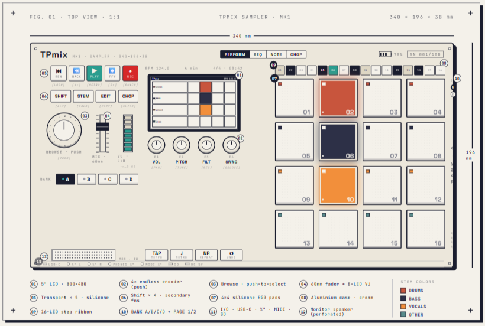
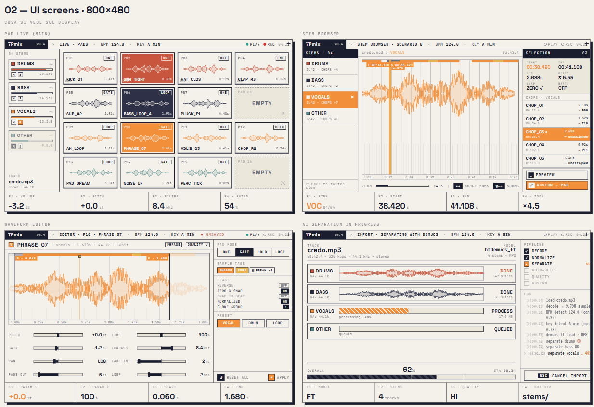

# TPmix Sampler — Prototipo Software

> *Importi una canzone → l'AI la separa in stem → suoni sui pad → salvi il kit sul device.*

Un sampler/drumpad con separazione AI integrata, scritto in Python come **prototipo software** del futuro hardware **TPmix MK1**.



> **TPmix MK1** — 340 × 196 × 38 mm · case in alluminio cream · 5" LCD 800×480 · 4×4 pad RGB in silicone · fader 60 mm con VU 8-LED · 4 encoder endless push · ribbon 16-LED · USB-C + MIDI + slot SD · monitor speaker integrato.

---

## ⏸️ Stato: in pausa volontaria

Il prototipo Python che vedi qui è **funzionante** e copre la storia completa: importi un brano → Demucs separa → l'auto-slicer crea i sample → li suoni sui pad → salvi tutto come kit portabile su un device virtuale.

Ma questo è solo un proof-of-concept.

**Il progetto entra in pausa per qualche mese** perché il prossimo passo non è "aggiungere features in Python" — è ripartire seri:

- 🔧 **Motore audio riscritto in C** — lock-free ring buffer, allocazione zero nel callback, latenza target < 5 ms, portabile su Raspberry Pi e su micro DSP embedded.
- 🖥️ **Hardware MK1 fisico** — PCB custom, case in alluminio fresato, encoder ottici, pad in silicone retro-illuminati con calibrazione velocity reale.
- ⚙️ **Firmware embedded** — gestione I/O, pad, encoder, LED feedback senza passare dal sistema operativo.
- 🧱 **Frontend desktop** — il Python QML attuale viene rimodellato come *editor* dei kit del device, non come strumento standalone.

Quando torna, torna come **prodotto vero**. Non come un'altra app Python qualsiasi.

---

## Come dovrebbe sentirsi — UI target



Quattro schermate principali del software finale:

| Vista | Cosa fa |
|---|---|
| **Pad Live** | Performance: 16 pad con waveform preview, 4 stem mixer (mute/solo/level), 4 encoder mappati a VOL · PITCH · FILT · SWING. |
| **Stem Browser** | Esplori i chop di ogni stem, preview, snap zero-crossing, "ASSIGN → PAD" su un pad mirato. |
| **Waveform Editor** | Editing sample-accurate: marker drag, snap zero-X + beat grid, tag (PHRASE/CORE/BREAK), pad mode (ONE/GATE/HOLD/LOOP), choke group, preset Vocal/Drum/Loop. |
| **AI Separation** | Pipeline Demucs visualizzata: DECODE → NORMALIZE → SEPARATE → AUTO-SLICE → QUALITY → ASSIGN, con log live, ETA e cancel. |

Aesthetic deciso: **cream / orange / navy**, mono tecnico, niente bordi gratuiti, ogni cosa leggibile da 50 cm su un 5".

---

## Cosa funziona oggi nel prototipo

Tutto quello che vedi nei mockup ha già un'implementazione funzionante in Python, in forma grezza:

**Audio**
- Import (`mp3 / wav / flac / ogg / m4a`) + analisi (BPM frazionario, time signature, key bilingue EN/IT, section detector).
- Separazione Demucs (`htdemucs` / `htdemucs_ft`) con fallback DSP-only se mancano i pesi.
- Noise reduction pre/post separazione (light/strong).
- Auto-slicing: phrase detection sui vocal, transient sui drum, loop con BPM sync.
- Pad engine: `sounddevice` + `numpy`, mixing per-pad, choke group, modi ONE / GATE / HOLD / LOOP, retrigger pulito.
- DSP sample-level: pitch + time stretch, reverse, highpass/lowpass, pan, gain, fade, loop seamless con extra-tail bake.
- Catena effetti per-pad e master: EQ 3 bande RBJ, compressor envelope, reverb Freeverb, delay con feedback, chorus LFO.

**Workflow**
- Kit portabili (`kit.json` + audio in cartella relocabile, path relativi, validazione integrità).
- Push su device virtuale via TCP localhost:5555 (length-prefixed JSON).
- Recorder eventi pad + player con quantize (0–100% blend), count-in, metronomo con click sintetizzati.
- Export sequenza offline → WAV; bounce live dell'uscita master con cap di sicurezza.

**UI**
- QML monolitica con waveform editor DAW-style (peaks decimati, view window, marker drag-preview/release-commit).
- 5 pannelli: Pads, Editor, FX, Browser, Settings (5 tab).
- Keyboard shortcuts QWERTY mappate sui pad + transport.

**85 test verdi** (unit + integration), QML headless load OK.

---

## Quick start

```bash
cd code
python -m venv venv

# Windows
venv\Scripts\activate

# macOS / Linux
source venv/bin/activate

pip install -r requirements.txt
pip install -r requirements-ai.txt    # opzionale: Demucs (~500 MB)

python -m app.main
```

**Headless / CLI**
```bash
python -m scripts.cli_run path/to/song.mp3
python -m scripts.render_demo
```

**Test**
```bash
pytest tests/ --basetemp=_tmptest
```

> Nota: `--basetemp=_tmptest` è un workaround per ambienti Windows dove `%TEMP%` ha permessi anomali.

---

## Architettura (snapshot del prototipo)

```
code/
├── app/
│   ├── audio/
│   │   ├── separation/   # Demucs + fallback euristico
│   │   ├── slicing/      # auto-slicer, pad assigner
│   │   ├── analysis/     # BPM, key, sections, vocal phrase, sample analyzer
│   │   ├── dsp/          # effects, noise reduction, waveform peaks, zero-X
│   │   ├── recording/    # recorder, player, sequence
│   │   ├── metronome/
│   │   ├── playback/     # sounddevice engine
│   │   └── export/       # offline render + bounce
│   ├── core/             # models, settings, logging
│   ├── hardware/         # virtual device (TCP), wire protocol, MIDI detect
│   ├── project/          # kit + preset persistence
│   ├── services/         # pipeline facade
│   └── ui/               # QML + Qt controller
├── scripts/              # CLI + demo render
└── tests/                # 85 test (unit + integration)
```

### Principi tenuti fissi

1. **Modelli puri** — `core/models.py` non sa nulla di I/O o audio: serializzabile, testabile, immutabile dove ha senso.
2. **Pipeline modulare** — separation → analysis → slicing → assignment → playback. Ogni stadio sostituibile.
3. **Sample-accurate** — tutti gli offset audio in *sample interi*, mai in secondi (stabile su resample, sync, export).
4. **Thread audio sacro** — il callback non alloca, non logga, non aspetta locks. Comandi UI → audio passano per una `queue.Queue` drenata a inizio callback.

---

## Roadmap reale

| Fase | Cosa | Quando |
|---|---|---|
| **0** — Prototipo Python | ✅ Pipeline end-to-end funzionante, 85 test verdi | Fatto |
| **Pausa** ⏸️ | Studio firmware, scelte componenti, design PCB, prototipi case | mesi |
| **1** — Motore C portabile | Engine audio lock-free, < 5 ms RTL, build per Linux + RPi | TBD |
| **2** — MK1 standalone | Hardware + firmware, kit caricati da SD | TBD |
| **3** — MK1 PC-connected | Sync USB con frontend Python per import/editing | TBD |
| **4** — Polish & beta | Calibrazione velocity reale, beta su utenti finali | TBD |

Niente date inventate. **Quando è pronto, è pronto.**

---

## Stack tecnico

**Oggi**
`Python 3.10+` · `PyQt6 / QML` · `numpy` · `scipy` · `sounddevice` · `librosa` · `soundfile` · `pyrubberband` · `Demucs` (opzionale)

**Domani**
`C` (motore) · `CMSIS-DSP` o equivalente ARM · `freertos` o bare-metal sul micro · `OpenGL ES` per il rendering UI sul 5" · Python solo come frontend desktop di companion.

---

## Filosofia

Niente feature creep. Niente "aggiungo X perché è facile". Ogni pezzo nel firmware finale deve **suonare bene** prima ancora di esistere come codice. Se ho un dubbio sull'audio, non lo metto.

> *"Make it work. Make it right. Make it fast."* — Kent Beck

Il prototipo Python qui dentro è la fase "make it work". Il salto a C + hardware è la fase "make it right". Il polish finale del MK1 è "make it fast".

---

## Cosa NON c'è (e non ci sarà nel prototipo Python)

Per scelta esplicita, queste cose sono **rinviate** all'hardware o cancellate del tutto:

- ❌ Looper performance multi-traccia (RC-505 style) — fuori scope, tagliato.
- ❌ REST / WebSocket / API di rete — non serve a un sampler.
- ❌ Plugin host VST3 — il MK1 ha effetti nativi, non plugin esterni.
- ❌ App mobile companion — magari un giorno, non oggi.
- ❌ Collaboration cloud — no.

Il prototipo Python serve a una cosa: **dimostrare la storia** (separa → suona → salva su device). Tutto il resto è rumore.

---

## Licenza

MIT.

---

**Made by Giovanni Avino** · 🇮🇹 · 2026
